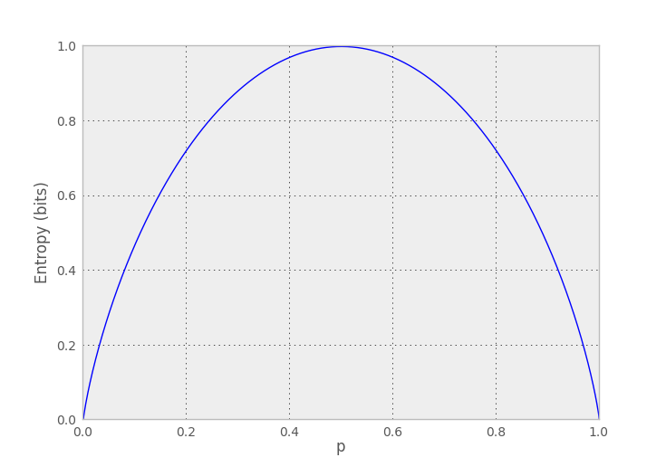

## Random Variables and Entropy ##

This code is in `prob.py`.

A finite random variable is specified by a pmf:

```python
class RV(object):
    def __init__(self,pmf):
        self._pmf = pmf

    def __repr__(self):
        return '%s(%s)' % (self.__class__.__name__,self._pmf)

    def pmf(self,x):
        if x in self._pmf:
            return self._pmf[x]
        else:
            return 0

    def range(self):
        return self._pmf.keys()
```

Entropy is a function of a random variable:

```python
def H(X):
    p = X.pmf
    return sum(-p(x) * log2(p(x)) for x in X.range() if p(x) > 0)
```

Here are some examples:

```python
In [1]: X = RV({0:0.5,1:0.5})

In [2]: X
Out[2]: RV({0: 0.5, 1: 0.5})

In [3]: H(X)
Out[3]: 1.0

In [4]: Y = RV({0:0.1,1:0.9})

In [5]: H(Y)
Out[5]: 0.46899559358928122

In [6]: Z = RV({'a':0.5,'b':0.25,'c':0.125,'d':0.125})

In [7]: H(Z)
Out[7]: 1.75


In [8]: W = RV({'a':0,'b':0,'c':1})

In [9]: H(W)
Out[9]: 0.0
```

A special binary random variable class can provide a convenient constructor:

```python
class BinaryRV(RV):
    def __init__(self,p):
        super(BinaryRV,self).__init__({0:1-p,1:p})
```

```python
In [1]: ps = np.linspace(0,1,1000)

In [2]: plt.plot(ps,[H(BinaryRV(p)) for p in ps])

In [3]: plt.xlabel('p')

In [4]: plt.ylabel('Entropy (bits)')
```



## Processes and Entropy Rates ##

This code is also in `prob.py`.

A discrete-time stochastic process is just a sequence of (possibly dependent)
random variables, one for each time step. A useful process object will be able
to generate a random sequence and also report its entropy rate.

```python
class Process(object):
    __metaclass__ = abc.ABCMeta

    def sample_sequence(self,N):
        return ''.join(islice(self.sequence_generator(),N))

    @abc.abstractmethod
    def sequence_generator(self):
        pass

    @abc.abstractmethod
    def H_rate(self):
        pass


def H_rate(process):
    return process.H_rate()
```

A simple process is just a sequence of independent and identically distributed
(IID) random variables. An entropy rate for an IID process is just the entropy
of its underlying random variable:

```python
class IIDProcess(Process):
    def __init__(self,pmf):
        self._rv = RV(pmf)

    def sequence_generator(self):
        X = self._rv
        while True:
            yield sample(X.range(),p=X._pmf.values())


    def H_rate(self):
        return H(self._rv)
```

```python
In [1]: X = IIDProcess({'a':0.2,'b':0.8})

In [2]: X.sample_sequence(20)
Out[2]: 'bbbbaabbbbbbbbabbbbb'

In [3]: X.sample_sequence(50)
Out[3]: 'bbbbbabbbbbbabbbbbbbbbbbabbbbbabbbbbabbbbbbbbbabbb'

In [4]: H_rate(X)
Out[4]: 0.72192809488736231

In [5]: H_rate(IIDProcess({0:0.5,1:0.5}))
Out[5]: 1.0
```

A slightly more interesting process is a Markov process, where the probability
of a symbol depends on the previous symbol, so there's a PMF for each symbol.

```python
class MarkovProcess(Process):
    def __init__(self,symbols,trans):
        self._symbols = symbols
        self._numstates = len(symbols)
        self._P = np.asarray(trans)
        self._pi = util.steady_state(self._P)

    def sequence_generator(self):
        state = sample(self._numstates,p=self._pi)
        while True:
            yield self._symbols[state]
            state = sample(self._numstates,p=self._P[state])

    def H_rate(self):
        P = self._P
        PlogP = P*log2(np.where(P != 0, P, 1))
        return -self._pi.dot(PlogP).sum()

```

```python
In [1]: process = MarkovProcess(('a','b','c','d'),
  ....:         np.array([[0.9,0.1,  0,  0],
  ....:                   [0.1,0.8,0.1,  0],
  ....:                   [  0,0.1,0.8,0.1],
  ....:                   [  0,  0,0.1,0.9]]))

In [2]: ''.join(process.sample_sequence(50))
Out[2]: 'aaaaaaaaaaaaaaaaaaaaaabbbbbcccccccccccccdddddddddd'

In [3]: ''.join(process.sample_sequence(75))
Out[3]: 'aaaaaaaaabbccccccddddcccccbbbbbbbbbbbaaabbbcccbbaaaaaaaaaaaaaaaaaaaaabbcccc'
```

## Compressing by Fitting Probabilistic Models ##

This code is in `compress.py`.

TODO Huffman, arithmetic

## Compressing Without Fitting Models ##

This code is also in `compress.py`.

TODO Lempel-Ziv

